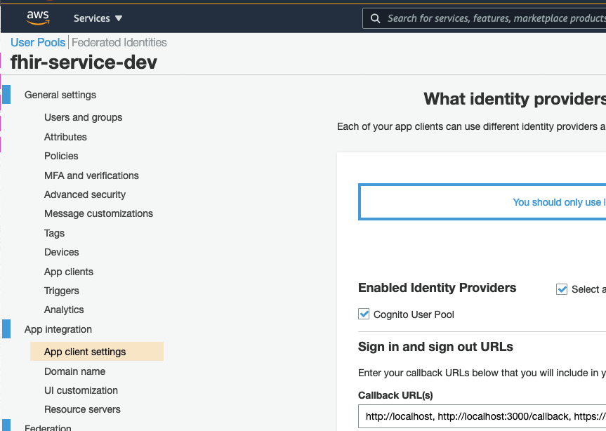

# Welcome to FHIR Works on AWS UI Demo

The `cdk.json` file tells the CDK Toolkit how to execute your app.

## Useful commands

- `yarn run build` compile typescript to js
- `yarn run watch` watch for changes and compile
- `yarn run cdk deploy` deploy this stack to your default AWS account/region
- `yarn run cdk diff` compare deployed stack with current state
- `yarn run cdk synth` emits the synthesized CloudFormation template

## Deploy Amplify application stack

This will create an Amplify application for you which will allow AWS Amplify to deploy the FHIR UI website to the internet. You will then have a copy of this code in CodeCommit which will auto deploy any new changes pushed to that repository.

Before proceeding, please get necessary parameters as outlined in [README](../README.md):

```
<REGION>
<REACT_APP_API_KEY>
<REACT_APP_CLIENT_ID>
<REACT_APP_FHIR_SERVER_URL>
```

Optional parameter `<BRANCH>` is a branch in your source code repository that you would like to link to the Amplify application. Default branch is `mainline`

You can construct `<REACT_APP_AUTH_URL>` as `https://<REACT_APP_CLIENT_ID>.auth.<REGION>.amazoncognito.com`

### CDK Deploy

Please make sure that you are in `amplify-infra` directory under your local repository root. If necessary, run `cd amplify-infra` from the repository's root.

```
#fhir-works-on-aws-ui/amplify-infra
yarn run cdk deploy -c fhir_server_url="<REACT_APP_FHIR_SERVER_URL>" -c auth_url="<REACT_APP_AUTH_URL>" -c client_id="<REACT_APP_CLIENT_ID>" -c api_key="<REACT_APP_API_KEY>" [-c amplify_branch="<BRANCH>"]
```

After deployment finishes, please save `<AMPLIFY_DOMAIN>` and `<REPO_NAME>` values from CDK app deployment:

```
AmplifyInfraStack.AmplifyDomain = <AMPLIFY_DOMAIN>
AmplifyInfraStack.CodeCommitRepo = <REPO_NAME>
```

### Update Cognito User Pool Client

**(RECOMMENDED)**

**Option 1** 

Please update list of callback URLs associated with your app client by editing [CloudFormation template in FHIR Works on AWS deployment package](https://github.com/awslabs/fhir-works-on-aws-deployment/blob/enable-cors/cloudformation/cognito.yaml#L40):

```
CallbackURLs:
  - !Ref CognitoOAuthDefaultRedirectURL
  -  http://localhost:3000/callback
  -  https://<AMPLIFY_DOMAIN>/callback

```

You will need to redeploy FHIR Works on AWS after making the change:

```
serverless deploy --aws-profile <AWS PROFILE> --stage <STAGE> --region <AWS_REGION>
```

**Option 2**

Alternatively, you can add additional callback URL using AWS management console.
In AWS management console, navigate to Cognito service, open user pool created for FHIR Works on AWS, and click on _App client settings_ on the navigation area on the left side of the screen, and update _Callback URL(s)_ setting by appending comma `,` and `https://\<AMPLIFY_DOMAIN>/callback` string to the existing list of URLs.


### Connect your local working copy to CodeCommit repository

 
 After running the CDK you should already have a repository set up in AWS Code Commit. Now you will need to upload your code to that CodeCommit repo.

You can do so by following these steps:
1. Set up your IAM user to allow access to CodeCommit by following [steps 1 to 3 here](https://docs.aws.amazon.com/codecommit/latest/userguide/setting-up-gc.html?icmpid=docs_acc_console_connect_np). Be sure to make note of your username and password.
2. Enable using https by running this command `git config credential.UseHttpPath true`
3. Go to your CodeCommit repo on the AWS Console and click the `Clone Url` button followed by `Clone HTTPS` to get the URL of your repo.
4. In your terminal, navigate to the root directory of your current fhir-works-on-aws-ui repo, and run the following commands
```
git remote add code-commit <HTTPS URL OF CODE COMMIT REPO>
git push code-commit mainline 
```

After you successfully pushed your local copy to CodeCommit using `git push`, AWS Amplify will build and deploy your application. You can verify when it is done in AWS Amplify console and then navigate to the deployed application.
